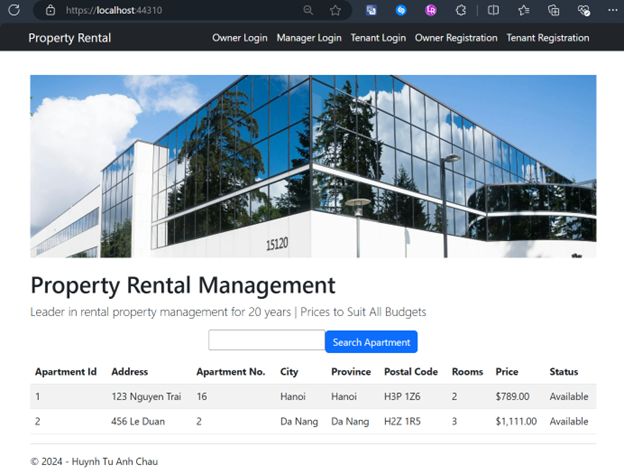
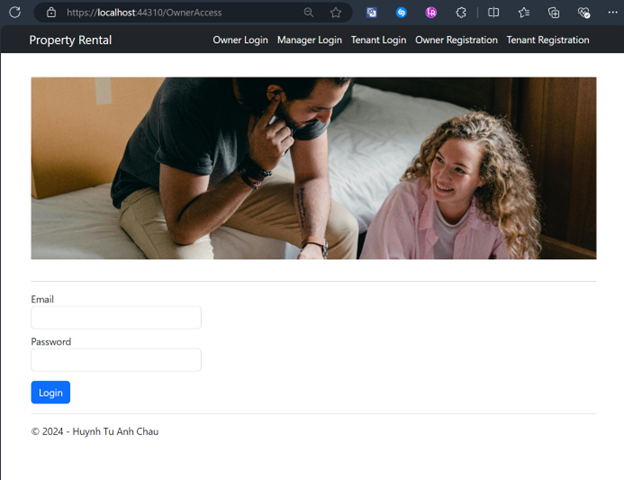
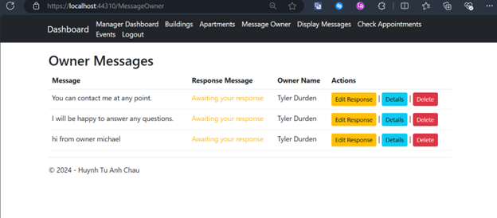
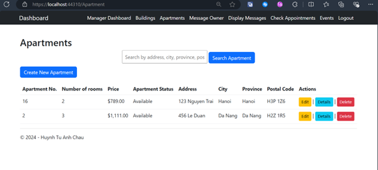
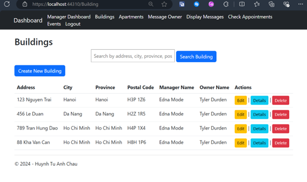
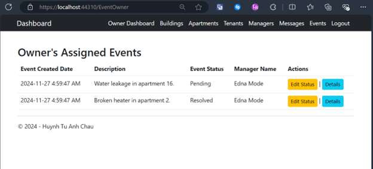
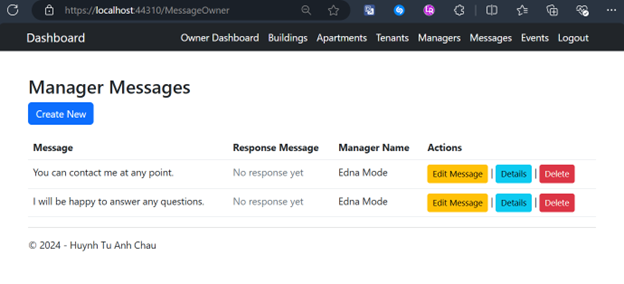
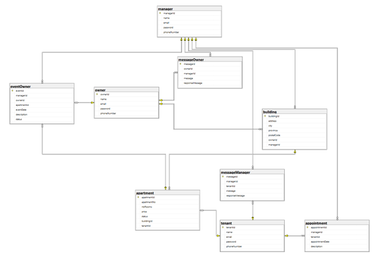

<div align="center">


# 🏠 Property Rental Management System

### Plataforma web de administración de propiedades y rentas 🚀

<p align="center">
  <b>Property Rental Management System</b> es una aplicación web desarrollada con ASP.NET MVC y Entity Framework para administrar propiedades, inquilinos, administradores y procesos de renta desde una plataforma moderna y segura.
</p>

<p align="center">
  
  
  
  
</p>

<p align="center">
  <a href="#-acerca-del-proyecto">Acerca</a> •
  <a href="#-módulos-del-sistema">Módulos</a> •
  <a href="#-características">Características</a> •
  <a href="#-tecnologías-utilizadas">Tecnologías</a> •
  <a href="#-vista-previa">Vista previa</a>
</p>

</div>

---

# 🌌 Acerca del proyecto

**Property Rental Management System** es una plataforma web enfocada en la gestión de propiedades y operaciones de renta inmobiliaria mediante una arquitectura basada en ASP.NET MVC y Entity Framework.

El sistema permite administrar:

- 🏠 Propiedades y apartamentos
- 👥 Inquilinos y administradores
- 📅 Citas y reservaciones
- 💬 Mensajería interna
- 📊 Paneles administrativos
- 🔐 Control de acceso seguro
- 📄 Gestión de eventos
- 🌐 Operaciones inmobiliarias

---

# ✨ Características

## 🏘️ Gestión de propiedades

- 🏠 Registro de edificios
- 🏢 Administración de apartamentos
- 📍 Gestión inmobiliaria
- 📋 Información detallada
- 🔍 Búsqueda avanzada

---

## 👥 Gestión de usuarios

- 👤 Registro de inquilinos
- 🛠️ Administración de managers
- 🔐 Inicio de sesión seguro
- ⚡ Roles y permisos
- 📄 Gestión de perfiles

---

## 💬 Comunicación y eventos

- 💬 Sistema de mensajes
- 📅 Reservación de citas
- 📢 Gestión de eventos
- 🔔 Notificaciones internas
- 📊 Seguimiento de actividades

---

## 📊 Dashboard administrativo

- 📈 Estadísticas del sistema
- 🏠 Gestión de propiedades
- 👥 Supervisión de usuarios
- 📅 Control de citas
- 🔐 Administración general

---

# 👨‍💼 Módulos del sistema

## 🏠 Owner Module

Módulo principal utilizado por los propietarios del sistema.

### Funcionalidades:

- 👥 Gestionar managers e inquilinos
- 🏢 Supervisar edificios
- 🏠 Consultar apartamentos
- 📅 Administrar eventos
- 💬 Gestionar mensajes
- ⚙️ Configuración de cuenta

---

## 🛠️ Manager Module

Módulo encargado de la administración inmobiliaria.

### Funcionalidades:

- 🏢 Gestión de edificios
- 🏠 Administración de apartamentos
- 📅 Gestión de citas
- 💬 Comunicación con usuarios
- 📊 Supervisión de propiedades
- ⚡ Control administrativo

---

## 👤 Tenant Module

Módulo destinado a los inquilinos del sistema.

### Funcionalidades:

- 🔍 Buscar apartamentos
- 📅 Reservar citas
- 💬 Contactar administradores
- 📋 Consultar propiedades
- 👤 Administrar perfil
- 🏘️ Explorar inmuebles

---

# 🛠️ Tecnologías utilizadas

## 🎨 Frontend

<p>
  
</p>

- HTML5
- CSS3
- Bootstrap
- JavaScript
- Razor Views

---

## ⚙️ Backend

<p>
  
</p>

- ASP.NET MVC
- C#
- Entity Framework
- Session Authentication
- Arquitectura MVC

---

## 🗄️ Base de datos

<p>
  
</p>

- SQL Server
- Entity Framework Database First
- Consultas SQL
- Persistencia de datos

---

## 🧰 Herramientas

<p>
  
</p>

- Git
- GitHub
- Visual Studio 2022
- SQL Server Management Studio

---

# 📂 Estructura del proyecto

```bash
PropertyRentalManagementSystem/
│
├── Controllers/              # Controladores MVC
├── Models/                   # Modelos Entity Framework
├── Views/                    # Interfaces Razor
├── Content/                  # Recursos CSS
├── Scripts/                  # Scripts JavaScript
├── imgs/                     # Capturas del sistema
├── App_Data/                 # Datos y configuraciones
├── script.sql                # Script de base de datos
├── Web.config                # Configuración ASP.NET
├── README.md
└── LICENSE
```

---

# ⚡ Instalación

## 📋 Requisitos

- Visual Studio 2022
- SQL Server Management Studio 19
- .NET Framework
- SQL Server

---

# 🚀 Configuración del proyecto

## 1️⃣ Clonar repositorio

```bash
git clone https://github.com/isairey/PropertyRentalManagementSystem.git
```

---

## 2️⃣ Configurar base de datos

Abrir:

```bash
script.sql
```

Importar en SQL Server Management Studio.

---

## 3️⃣ Abrir proyecto

Abrir solución en:

```bash
Visual Studio 2022
```

---

## 4️⃣ Configurar conexión

Editar:

```bash
Web.config
```

Agregar credenciales SQL Server.

---

## 5️⃣ Ejecutar aplicación

Iniciar proyecto desde Visual Studio:

```bash
IIS Express
```

---

# 📊 Funcionalidades principales

## 🏠 Administración inmobiliaria

- Gestión de edificios
- Administración de apartamentos
- Registro de propiedades
- Seguimiento de rentas

---

## 👥 Gestión de usuarios

- Roles diferenciados
- Seguridad por sesiones
- Administración de perfiles
- Comunicación interna

---

## 📅 Sistema de citas

- Reservaciones
- Gestión de visitas
- Agenda de managers
- Seguimiento de actividades

---

# 📸 Vista previa

## 🖥️ Interfaces del sistema

<div align="center">

### 🏠 Página principal


### 🔐 Inicio de sesión de propietario


### 📊 Dashboard de manager


### 🏢 Gestión de apartamentos


### 🏠 Gestión de edificios


### 📅 Eventos del sistema


### 💬 Comunicación entre usuarios


### 🧠 Diagrama del sistema


</div>

---

# 🔑 Credenciales de prueba

| Rol | Correo | Contraseña |
|------|---------|-------------|
| 👑 Owner | tylerdurden@gmail.com | password123 |
| 🛠️ Manager | ednamode@gmail.com | password123 |
| 👤 Tenant | michaelcorleone@gmail.com | password123 |

---

# 🧠 Objetivos del proyecto

## 🎯 Aprendizaje y administración

- Desarrollo web con ASP.NET MVC
- Entity Framework
- Gestión inmobiliaria
- Arquitectura MVC
- Seguridad por sesiones
- Bases de datos SQL Server
- Interfaces administrativas

---

# 🚧 Roadmap

## 🔮 Próximas mejoras

- 📱 Aplicación móvil
- ☁️ Deploy cloud
- 💳 Pagos electrónicos
- 📊 Dashboard avanzado
- 🔔 Notificaciones en tiempo real
- 🌐 API REST
- 🤖 Recomendaciones inteligentes

---

# 🤝 Contribuciones

Las contribuciones son bienvenidas ❤️

## Cómo contribuir

1. Fork del proyecto

```bash
git checkout -b feature/nueva-funcionalidad
```

2. Commit

```bash
git commit -m "✨ Nueva funcionalidad"
```

3. Push

```bash
git push origin feature/nueva-funcionalidad
```

4. Pull Request 🚀

---

# 👨‍💻 Desarrollador

<div align="center">

## Isai Reyes — Full Stack Developer

Desarrollador apasionado por plataformas inmobiliarias, sistemas administrativos y aplicaciones empresariales modernas 🚀

</div>

---

# 🌟 Apoya el proyecto

⭐ Dale una estrella  
🍴 Haz fork  
📢 Comparte el proyecto

---

# 📜 Licencia

Proyecto open source orientado al aprendizaje y administración de sistemas inmobiliarios utilizando ASP.NET MVC.

---

<div align="center">

### 🏠 Property Rental Management System — administración moderna de propiedades y rentas 🚀

</div>
